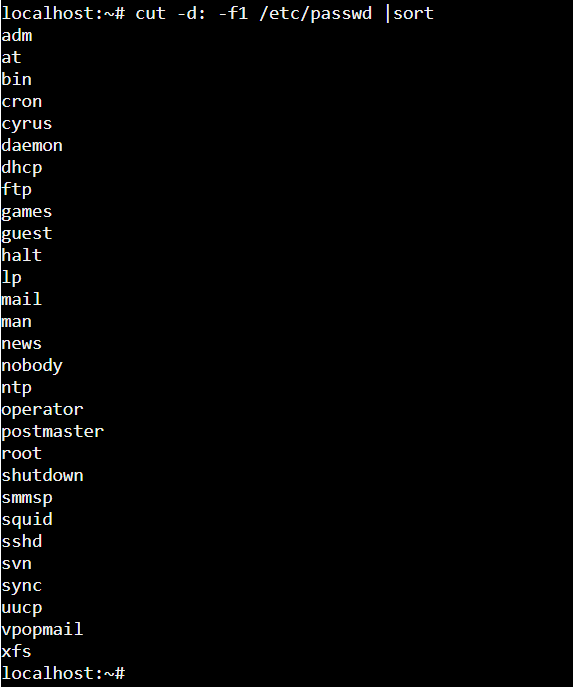
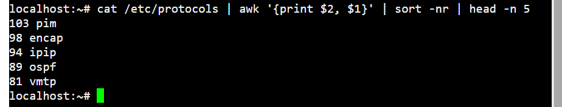

# Практическое занятие №1. Введение, основы работы в командной строке


## Задача 1
```cut -d: -f1 /etc/passwd |sort```



## Задача 2
```awk '{print $2, $1}' /etc/protocols | sort -k1,1nr | head -n 5```



## Задача 3
```
#!/bin/bash

text=$*
length=${#text}

for i in $(seq 1 $((length + 2))); do
    line+="-"
done

echo "+${line}+"
echo "| ${text} |"
echo "+${line}+"
```            


## Задача 4
```
#!/bin/bash

file="$1"

id=$(grep -o -E '\b[a-zA-Z]*\b' "$file" | sort -u)
```


## Задача 5
```#!/bin/bash

file=$1

chmod 755 "./$file"

sudo cp "$file" /usr/local/bin/
```


